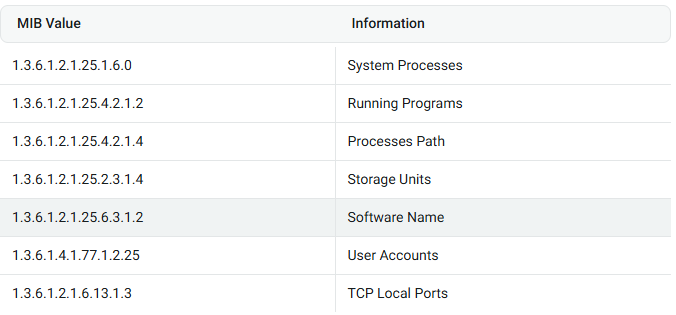

# SNMP

```bash
sudo onesixtyone -c /usr/share/wordlists/seclists/Discovery/SNMP/snmp.txt $IP
sudo onesixtyone -c /usr/share/wordlists/seclists/Discovery/SNMP/snmp.txt -i ips.txt
```

<figure><figcaption></figcaption></figure>

```bash
# entire MIB tree
snmpwalk -c public -v1 -t $IP
# users
snmpwalk -c public -v1 $IP 1.3.6.1.4.1.77.1.2.25
# running process
snmpwalk -c public -v1 $IP 1.3.6.1.2.1.25.4.2.1.2
# process path
snmpwalk -c public -v1 $IP 1.3.6.1.2.1.25.4.2.1.4
# open tcp ports
snmpwalk -c public -v1 $IP 1.3.6.1.2.1.6.13.1.3
# installed softwares
snmpwalk -c public -v1 $IP 1.3.6.1.2.1.25.6.3.1.2
```


```bash
sudo apt-get install snmp-mibs-downloader
sudo download-mibs

# Finally comment the line saying "mibs :" in /etc/snmp/snmp.conf
sudo vi /etc/snmp/snmp.conf

snmpwalk -v [VERSION_SNMP] -c public $IP NET-SNMP-EXTEND-MIB::nsExtendObjects #get exte
```
